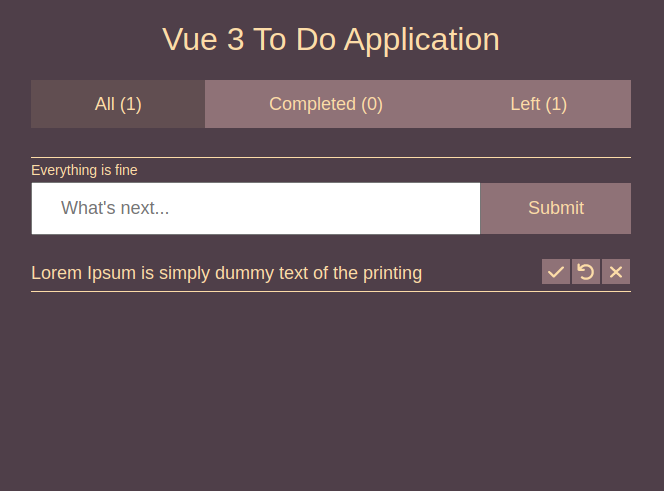

# vue 3 to-do

This is a to-do list to practice Vue 3 knowledge

## Project Setup

```sh
npm install
```

### Compile and Hot-Reload for Development

```sh
npm run dev
```

### Compile and Minify for Production

```sh
npm run build
```


